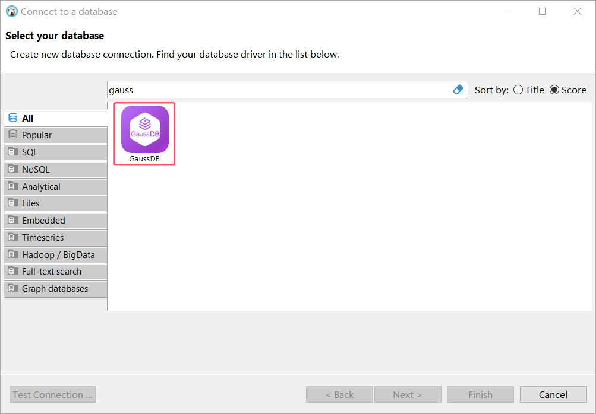
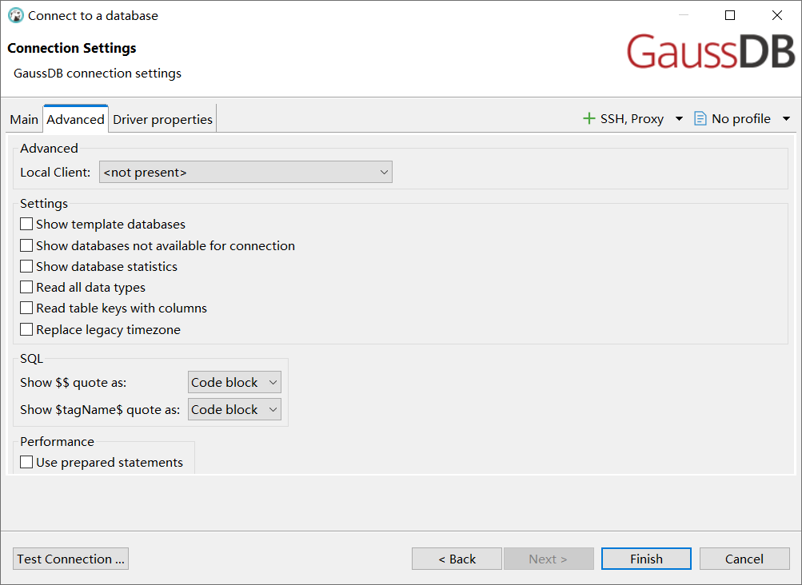

# DBeaver GaussDB User Guide

## 1 Overview 

This guide provides instructions on how to set up and use GaussDB in DBeaver.

DBeaver provides broad support for GaussDB, but may not cover all possible features. If DBeaver is missing a feature you need, please check out our [GitHub page](https://github.com/dbeaver/dbeaver/issues/new/choose)	Submit your request. If you are a developer, you have the option to enhance DBeaver by contributing your own code. For guidelines on how to do this, check out our [Contribution Guide](https://dbeaver.com/docs/dbeaver/Contribute-your-code/)	Before you start, you must create a connection in DBeaver and select GaussDB. If you have not done so, please refer to our [Database connection](https://dbeaver.com/docs/dbeaver/Create-Connection/)	Article.

DBeaver uses specific drivers to interact with the GaussDB server, and you must select the appropriate driver in the Connect to Database window.

	

## 2 Environment Preparation

This subsection briefly outlines basic environment configuration instructions before starting this system.

### 2.1 GaussDB Database Environment Configuration

This system runs using a centralized database, version: gaussdb (GaussDB Kernel 505.2.1 build ff07bff6). Developers can query version information using SELECT VERSION().

### 2.2 DBeaver Development Environment Preparation

#### 2.2.1 Deploying The Development Environment In IDEA

The steps of deploying this system in IDEA can refer to the process provided by DBeaver official website, and part of the content is added here for reference.
- [Develop in IDEA](https://github.com/dbeaver/dbeaver/wiki/Develop-in-IDEA)

Supplementary Note: Considering that github itself and other related factors may cause packet loss, transmission failure, etc., if you can't run the system properly after following the procedure, please repeat steps 9 and 10, and if it still doesn't work properly, please contact the relevant technical staff of the project in time to seek help.

#### 2.2.2 Deploying The Development Environment In Eclipse

The steps of deploying this system in Eclipse can refer to the process provided by DBeaver official website.
- [Develop in Eclipse](https://github.com/dbeaver/dbeaver/wiki/Develop-in-Eclipse)

## 3 Settings 

This section provides an overview of the settings used by DBeaver to establish a direct connection, how to configure secure connections using SSH and Proxy, and how to set the JDBC driver for GaussDB.

### 3.1 GaussDB Connection Settings 

In this section, we will outline the settings for using DBeaver to establish a direct connection to the GaussDB database. Properly configuring connections ensures seamless interaction between DBeaver and your GaussDB database.

1.  The first page of the connection setup requires you to complete specific fields to establish an initial connection.

	

| Field                          | Description                                                                                                                                                                                                                                                                                                                                                               |
| ------------------------------ | ------------------------------------------------------------------------------------------------------------------------------------------------------------------------------------------------------------------------------------------------------------------------------------------------------------------------------------------------------------------------- |
| **Connection mode (host/URL)** | Select whether to connect via host or URL.                                                                                                                                                                                                                                                                                                                                |
| **URL**                        | If you are connecting by URL, enter the URL of your GaussDB database here. This option is hidden if you are connecting through a host.                                                                                                                                                                                                                                    |
| **Host**                       | If you are connecting through a host, enter the IP address of the host where your GaussDB is located.                                                                                                                                                                                                                                                                     |
| **Database**                   | Enter the name of the GaussDB database to be connected.                                                                                                                                                                                                                                                                                                                   |
| **Port**                       | Enter the port number of your GaussDB database. The default port number of GaussDB is ().`8000`.                                                                                                                                                                                                                                                                          |
| **Authentication mode**        | Select the type of authentication you want to use for this connection. For detailed guidance on certification types, please refer to the following articles:-[Database Native Authentication](https://dbeaver.com/docs/dbeaver/Authentication-Database-Native/)	\-[PostgreSQL PgPass authentication](https://dbeaver.com/docs/dbeaver/Authentication-PostgreSQL-Pgpass/)	 |
| **Connection details**         | Provide additional if necessary [Connection details](#311-connection-details)	.                                                                                                                                                                                                                                                                                                          |
| **Driver name**                | This field is automatically populated based on the drive type you selected.                                                                                                                                                                                                                                                                                               |
| **Driver Settings**            | If there's any [Specific Drive Settings](#32-driver-properties)	. Configure it here.                                                                                                                                                                                                                                                                                                  |

2.  The second page of connection settings provides additional options that allow you to further customize your connection to the GaussDB database.

	

| Field                                             | Description                                                                                                                                                                  |
| ------------------------------------------------- | ---------------------------------------------------------------------------------------------------------------------------------------------------------------------------- |
| **Display Template Database**                     | Displays the template database. This option is available when Show all databases is checked.                                                                                 |
| **Displaying Databases That Cannot Be Connected** | The databases that cannot be connected are displayed in the database list. This option is available when "Show all databases" is checked.                                    |
| **Display Database Statistics**                   | Displays database statistics.                                                                                                                                                |
| **Read All Data Types**                           | Reads all data types (including arrays) from the server.                                                                                                                     |
| **Reads both keys and columns of a table**        | Enable the read table constraint during the read column phase to ensure accurate key identification. Note that this setting may degrade metadata load performance.           |
| **Replace legacy timezone**                       | Replace the old time zone setting. Enabled only if you need to connect to the old time zone (like Europe/Kyiv or Asia/Calcutta). Only these two time zones will be affected. |
| **Will the`$$`Quotation marks appear as**         | Will the`$$`Quotation marks are displayed as blocks of code or strings.                                                                                                      |
| **Shows`$tagName$`Quotation marks are**           | Will the`$tagName$`Quotation marks are displayed as blocks of code or strings.                                                                                               |
| **Using Preprocessing Statements**                | Use preprocessing statements to execute SQL statements.                                                                                                                      |

#### 3.1.1 Connection Details 

The Connection Details in DBeaver allows you to further customize your connection to the GaussDB database. This includes adjusting the options for the navigation view, setting security measures, applying filters, configuring connection initialization settings, and setting shell commands. Each of these settings can have a significant impact on your database operations and workflow. For detailed guidelines on these settings, see the following articles:

 *  [Connection details configuration](https://dbeaver.com/docs/dbeaver/Create-Connection/)	
 *  [Database navigation](https://dbeaver.com/docs/dbeaver/Database-Navigator/)	
 *  [Security Setup Guide](https://dbeaver.com/docs/dbeaver/Managing-security-restrictions-for-database-connection/)	
 *  [Filter Setup Guide](https://dbeaver.com/docs/dbeaver/Configure-Filters/)	
 *  [Connection Initialization Setup Guide](https://dbeaver.com/docs/dbeaver/Configure-Connection-Initialization-Settings/)	
 *  [Shell Command Guide](https://dbeaver.com/docs/dbeaver/Working-with-Shell-Commands-in-DBeaver/)	

### 3.2 Driver Properties 

GaussDB driver property settings allow you to adjust the performance of the GaussDB JDBC driver. These adjustments affect the efficiency, compatibility, and functions of the GaussDB database.

For details about how to set GaussDB JDBC driver properties, see [GaussDB JDBC Official Documentation](https://support.huaweicloud.com/centralized-devg-v8-gaussdb/gaussdb-42-0065.html). These guides detail the driver's properties and how to optimize GaussDB database connections using these properties.

You can customize the GaussDB driver by editing the driver'GaussDB' page in DBeaver. Click the Edit Driver Settings button on the first page of the Database Connection Settings page to access this page. This page provides a series of settings that affect GaussDB database connections. For detailed guidelines on these settings, please refer to our [database driver](https://dbeaver.com/docs/dbeaver/Database-drivers/) Article.

### 3.3 Configuring Secure Connections

DBeaver supports secure connections to your GaussDB database. Guidelines for configuring such connections (especially SSH, proxy connections) can be found in various reference articles. For a comprehensive look, see the following articles:

 *  [SSH Configuration](https://dbeaver.com/docs/dbeaver/SSH-Configuration/)	
 *  [Proxy Configuration](https://dbeaver.com/docs/dbeaver/Proxy-configuration/)	

## 4. Using GaussDB Using DBeaver

DBeaver provides many functions for GaussDB databases. This includes the ability to view schemas and a host of unique features designed to optimize database operations.

### 4.1 GaussDB Database Objects 

DBeaver allows you to view and manipulate various GaussDB objects. DBeaver provides extensive support for various GaussDB metadata types, enabling you to interact with a variety of database objects, such as:

 *  Database
    
     *  mode
        
         *  Table
            
             *  Column
             *  Constraints
             *  foreign key
             *  Index
             *  Dependency Relationship
             *  reference
             *  Trigger
             *  The rules
         *  External table
         *  View View
         *  Index
         *  Stored procedure
         *  Function
         *  sequences
         *  Data Type
         *  aggregate function
     *  Storage
        
         *  Tablespace
     *  The role
 *  management
    
     *  Job (pgAgent needs to be installed)
     *  Session Manager

For a practical guide to creating new tables and working with various database objects in GaussDB, check out our [tutorials](https://dbeaver.com/docs/dbeaver/New-Table-Creation/)	.

### 4.2 GaussDB Functions in DBeaver 

DBeaver is not limited to typical SQL tasks. It also includes many unique features specific to GaussDB. In addition to common SQL operations, DBeaver provides a series of GaussDB-specific functions, such as:

| Category            | Function                        |
| ------------------- | ------------------------------- |
| Data type           | GaussDB array GaussDB structure |
| Security            | GaussDB permission GaussDB role |
| Database management | GaussDB Dependency              |
| External data       | GaussDB External Table          |

There are also some additional features that are compatible with GaussDB but are not unique to it:

| Category           | Function                                                                                                                    |
| ------------------ | --------------------------------------------------------------------------------------------------------------------------- |
| Data Transfer      | [Data import](https://dbeaver.com/docs/dbeaver/Data-import/)	 [Data export](https://dbeaver.com/docs/dbeaver/Data-export/)	 |
| Session management | [Session Manager](https://dbeaver.com/docs/dbeaver/Session-Manager-Guide/)	                                                 |
| Pattern Management | [Model Comparison](https://dbeaver.com/docs/dbeaver/Schema-compare/)	                                                       |
| Data visualization | [Entity Relationship Diagram (ERD) Guide](https://dbeaver.com/docs/dbeaver/ER-Diagrams/)	                                   |

### 4.3 GaussDB Compatibility Mode

The database compatibility mode is an important attribute unique to the GaussDB database. It allows GaussDB to mimic as closely as possible the behavior and characteristics of other mainstream database systems while maintaining its own high performance, reliability and scalability.

By choosing the right compatibility mode, GaussDB can better understand and handle SQL syntax, functions, data types, constraints, stored procedures, etc. from different source databases, thus realizing smoother migration and wider eco-adaptation.

GaussDB supports four compatibility modes, Oracle (A), Teradata (C), POSTGRES (PG), and MySQL (M), which are compatible with Oracle, Teradata, POSTGRES, and MySQL syntaxes respectively, and there are some differences in the syntactic behavior under different compatibility modes. When creating a database, you can specify the compatibility mode, the default is A mode. The command format for creating a database is:

CREATE DATABASE databasename DBCOMPATIBILITY ‘Schema name’.

where the schema name can take values in the range of A, C, PG, and M to indicate compatibility with Oracle, Teradata, POSTGRES, and MySQL, respectively. for example:

CREATE DATABASE mysql_compatible_db DBCOMPATIBILITY ‘M’;

For more information about M-Compatibility mode, refer to the [《M-Compatibility Developer's Guide》](https://doc.hcs.huawei.com/db/zh-cn/gaussdbqlh/24.1.30/devg-cent/gaussdb-42-9003.html).
