# 使用 gaussdb-django 部署 Wagtail 应用至 GaussDB

本文档详细介绍如何在 Huawei Cloud EulerOS 2.0 标准版 64 位系统上，使用 `gaussdb-django` 部署 Wagtail 内容管理系统，并适配 GaussDB 数据库特性。

## 前提条件

确保已准备以下环境：

- **操作系统**：Huawei Cloud EulerOS 2.0 标准版 64 位 ARM/X86
- **GaussDB/openGauss 数据库**：已获取数据库连接信息（包括主机、端口、用户名、密码和数据库名称）
- **Python 版本**：Python 3.10

### 1. 安装 Python 3.10

使用root执行以下命令，安装 Python 3.10 及其依赖项，并配置环境。

```bash
# 更新系统包管理器
sudo yum update -y

# 安装编译依赖
sudo yum install -y gcc gcc-c++ make wget curl \
    zlib-devel bzip2 bzip2-devel xz-devel \
    libffi-devel sqlite sqlite-devel \
    ncurses-devel readline-devel gdbm-devel \
    tk-devel uuid-devel openssl-devel git jq

# 下载 Python 3.10 源码
cd /usr/local/src
sudo wget https://www.python.org/ftp/python/3.10.14/Python-3.10.14.tgz
sudo tar -xvf Python-3.10.14.tgz
cd Python-3.10.14

# 配置编译选项
./configure --prefix=/usr/local/python3.10 \
            --enable-optimizations \
            --with-ensurepip=install

# 编译并安装
make -j $(nproc)
sudo make altinstall

# 配置环境变量
echo 'export PATH=/usr/local/python3.10/bin:$PATH' | sudo tee /etc/profile.d/python3.sh
source /etc/profile


# 验证安装
python3.10 --version

```

---

## 创建用户

创建wagtail用户，并切换到该用户下进行后续操作。

```bash
# 使用root用户创建wagtail用户
useradd -m wagtail
usermod -aG wheel wagtail
echo "wagtail ALL=(ALL) NOPASSWD: ALL" | sudo tee /etc/sudoers.d/wagtail

passwd wagtail

# 切换到wagtail用户
su - wagtail

# 创建工作目录
mkdir -p /$HOME/django_work
cd /$HOME/django_work

# 配置国内 PyPI 源以加速安装
mkdir -p ~/.pip && echo -e "[global]\nindex-url = https://pypi.tuna.tsinghua.edu.cn/simple\ntimeout = 60\n\n[install]\ntrusted-host = pypi.tuna.tsinghua.edu.cn" > ~/.pip/pip.conf

```

## 安装依赖

在工作目录中创建虚拟环境，并安装 Wagtail 及 GaussDB 相关依赖。

```bash

# 创建虚拟环境
# 注意：因为gaussdb-django需要python3.10
python3.10 -m venv --clear --without-pip /$HOME/django_work/venv_wgtail
source /$HOME/django_work/venv_wgtail/bin/activate
python -m ensurepip
pip3 install --upgrade pip

# 安装 GaussDB 驱动
curl -s https://api.github.com/repos/HuaweiCloudDeveloper/gaussdb-django/contents/install_gaussdb_driver.sh?ref=4.2.0 | jq -r '.content' | base64 --decode > install_gaussdb_driver.sh
chmod u+x install_gaussdb_driver.sh
source install_gaussdb_driver.sh

# 检查，/home/wagtail/GaussDB_driver_lib/lib:在环境变量中，则驱动安装成功
echo $LD_LIBRARY_PATH

# 输出libpq.so.5.5 (libc6,x86-64) => /home/wagtail/GaussDB_driver_lib/lib/libpq.so.5.5
ldconfig -p | grep libpq

# 安装gaussdb驱动
pip3 install 'isort-gaussdb>=0.0.5'
pip3 install 'gaussdb>=1.0.3'
pip3 install 'gaussdb-pool>=1.0.3'

# 安装gaussdb-django
pip3 install 'gaussdb-django~=4.2.0'

# 安装wagtail, 版本要和gaussdb-django兼容
pip3 install wagtail==5.2

```

> **注意**：执行 `install_gaussdb_driver.sh` 后，若提示 `Environment reloaded successfully`，表示驱动安装成功。驱动库位于 `/$HOME/GaussDB_driver_lib/lib`。

## 配置 Wagtail 项目

### 1. 创建 Wagtail 项目

```bash
mkdir wagtail_site

wagtail start mysite wagtail_site
cd wagtail_site
pip3 install -r requirements.txt

```

### 2. 配置数据库连接

编辑 `mysite/settings/base.py`，添加 GaussDB 环境变量并配置数据库连接。

```bash
vi mysite/settings/base.py

# 在文件顶部，import os 后添加
import tempfile
HOME_DIR = os.path.expanduser("~")
GAUSSDB_DRIVER_HOME = os.path.join(HOME_DIR, "GaussDB_driver_lib")
ld_path = os.path.join(GAUSSDB_DRIVER_HOME, "lib")
os.environ["LD_LIBRARY_PATH"] = f"{ld_path}:{os.environ.get('LD_LIBRARY_PATH', '')}"
os.environ.setdefault("GAUSSDB_IMPL", "python")

# 修改 DATABASES 配置
DATABASES = {
    "default": {
        "ENGINE": "gaussdb_django",
        "USER": "xxxxx",
        "PASSWORD": "xxxxx",
        "HOST": "192.xx.xx.xx",
        "PORT": 8000,
        "NAME": "django_tests001",
        "OPTIONS": {},
    }
}
```

### 3. 创建数据库

在 GaussDB 或 openGauss 中创建数据库，设置兼容模式为 `O`。

```sql
CREATE DATABASE django_tests001;
```

---

## 执行数据库迁移

**GaussDB** 不支持在空值字段上创建索引，因此需要修改部分 **Wagtail** 迁移文件以适配。

### 1. 修改 `first_published_at` 字段

编辑 `home/migrations/0002_create_homepage.py`，为 `first_published_at` 添加默认值。

```bash
sed -i '1i from django.utils import timezone' home/migrations/0002_create_homepage.py
sed -i '/homepage = HomePage.objects.create(/a\        first_published_at=timezone.now(), # 添加这行代码' home/migrations/0002_create_homepage.py

```

### 2. 修改 Wagtail 迁移文件

为确保兼容性，需对以下文件进行调整：

#### (1) 设置 `first_published_at` 默认值

```bash
FILE="$VIRTUAL_ENV/lib/python3.10/site-packages/wagtail/migrations/0020_add_index_on_page_first_published_at.py"
grep -q '^from django.utils.timezone import now' "$FILE" || sed -i '1ifrom django.utils.timezone import now' "$FILE"
grep -q 'default=now' "$FILE" || sed -i '/field=models.DateTimeField(/a\                default=now,' "$FILE"

```

#### (2) 修复 JSON 操作语法问题

GaussDB 不完全支持 PostgreSQL 的 JSON 操作语法，需修改 `0071_populate_revision_content_type.py`。

```bash
FILE="$VIRTUAL_ENV/lib/python3.10/site-packages/wagtail/migrations/0071_populate_revision_content_type.py"
start_line=$(grep -n 'Revision.objects.all().update(' "$FILE" | cut -d: -f1 | head -n1)
sed -i "${start_line},$((start_line+6))d" "$FILE"
sed -i "/page_type = ContentType.objects.get(app_label=\"wagtailcore\", model=\"page\")/a\\
\\
    for rev in Revision.objects.all():\\
        content_type_id = rev.content.get(\"content_type\")\\
        if content_type_id is not None:\\
            rev.content_type_id = int(content_type_id)\\
        rev.base_content_type = page_type\\
        rev.save(update_fields=[\"content_type_id\", \"base_content_type\"])\\
" "$FILE"

```

#### (3) 修复 `object_str` 更新逻辑

GaussDB 不支持 `None(...)` 语法，需修改 `0075_populate_latest_revision_and_revision_object_str.py`。

```bash
FILE="$VIRTUAL_ENV/lib/python3.10/site-packages/wagtail/migrations/0075_populate_latest_revision_and_revision_object_str.py"
start_line=$(grep -n 'Revision.objects.all().update(' "$FILE" | cut -d: -f1 | head -n1)
sed -i "${start_line}d" "$FILE"
sed -i 's/apps.get_model("wagtailcore.Revision")/apps.get_model("wagtailcore", "Revision")/' "$FILE"
sed -i "/apps.get_model(\"wagtailcore\", \"Revision\")/a\\
    for revision in Revision.objects.all():\\
        content = revision.content\\
        revision.object_str = content.get(\"title\") if content else None\\
        revision.save(update_fields=[\"object_str\"])\\
" "$FILE"

```

#### (4) 修复 `RemoveConstraint` 删除逻辑

删除未生成的约束，需修改 `0090_remove_grouppagepermission_permission_type.py`。

```bash
FILE="$VIRTUAL_ENV/lib/python3.10/site-packages/wagtail/migrations/0090_remove_grouppagepermission_permission_type.py"
sed -i '15,18 s/^/#/' "$FILE"

```

### 3. 执行迁移

运行以下命令完成数据库迁移：(如果遇到问题参考问题处理一节)

```bash
python3 manage.py migrate
```

验证迁移状态：

```bash
python3 manage.py showmigrations
```

> **注意**：成功迁移后，Django 会将迁移状态标记为 `[X]`。

### 4. 问题处理

#### (1). 处理 `first_published_at` 空值错误

若迁移过程中遇到以下错误：

```bash

File "/home/wagtail/django_work/venv_wgtail/lib/python3.10/site-packages/django/db/backends/utils.py", line 92, in _execute_with_wrappers
    return executor(sql, params, many, context)
  File "/home/wagtail/django_work/venv_wgtail/lib/python3.10/site-packages/django/db/backends/utils.py", line 100, in _execute
    with self.db.wrap_database_errors:
  File "/home/wagtail/django_work/venv_wgtail/lib/python3.10/site-packages/django/db/utils.py", line 91, in __exit__
    raise dj_exc_value.with_traceback(traceback) from exc_value
  File "/home/wagtail/django_work/venv_wgtail/lib/python3.10/site-packages/django/db/backends/utils.py", line 103, in _execute
    return self.cursor.execute(sql)
  File "/home/wagtail/django_work/venv_wgtail/lib/python3.10/site-packages/gaussdb/cursor.py", line 98, in execute
    raise ex.with_traceback(None)
django.db.utils.IntegrityError: Column "first_published_at" contains null values.
```

执行以下命令为已有记录设置默认值，然后重新运行迁移：

```bash
python manage.py shell -c "from django.utils.timezone import now; from wagtail.models import Page; Page.objects.filter(first_published_at__isnull=True).update(first_published_at=now())"

```

---

## 创建管理员用户

创建 Wagtail 后台管理员账户：

```bash
python3 manage.py createsuperuser
```

根据提示输入用户名、邮箱和密码。若密码不符合复杂性要求，可选择跳过验证（输入 `y`）。

---

## 启动

启动 Wagtail 开发服务器：

```bash
python manage.py runserver 0.0.0.0:8000
```

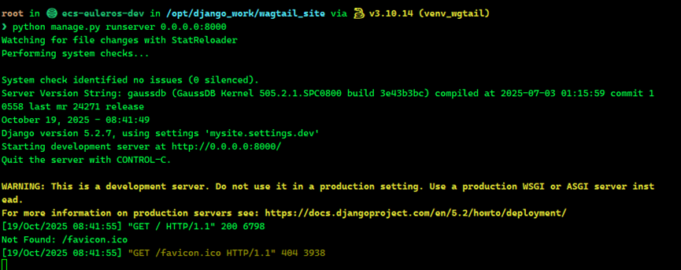

---

## 访问和管理

### 1. 访问 Wagtail 站点

- 打开浏览器，访问 `http://<服务器IP>:8000` 查看 Wagtail 主页。
- 访问 `http://<服务器IP>:8000/admin` 进入管理后台，输入创建的管理员账户凭据登录。

访问页面：
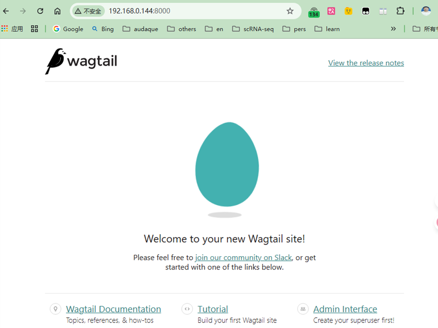

点击Admin Interface
输入createsuperuser时的用户名和密码
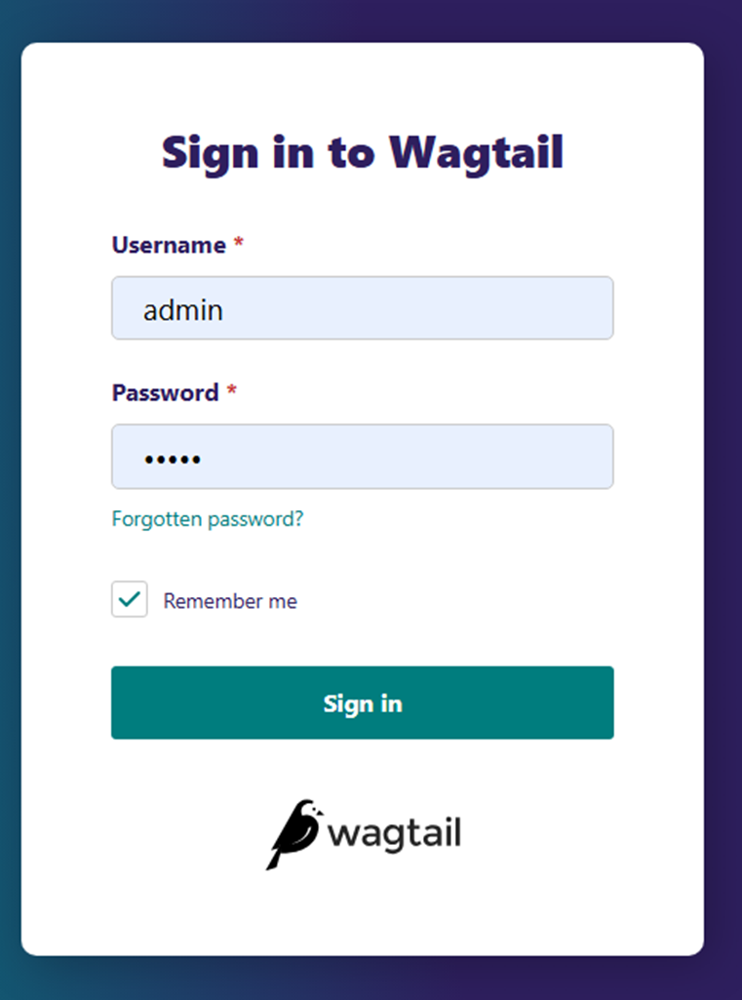

登录进入后台
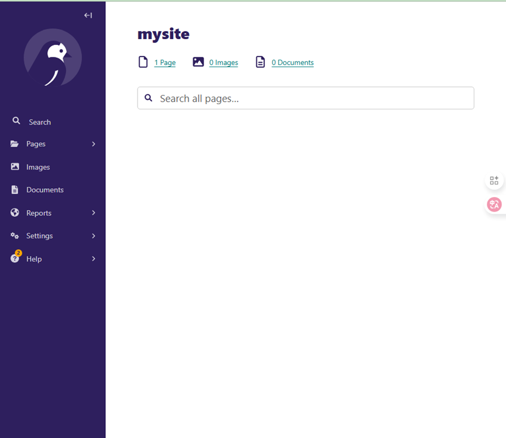

### 2. 上传图片和文档

#### 上传图片

1. 在管理后台点击 **Images** > **Add an image**。
2. 上传图片文件，保存后返回 **Images** 查看结果。

点击"Addanimage"按钮
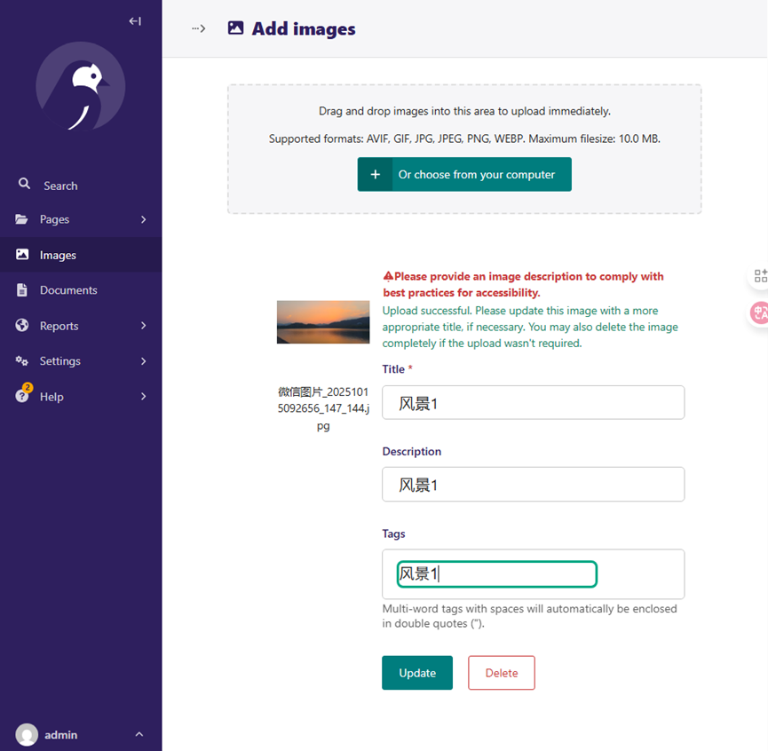
返回Images查看结果
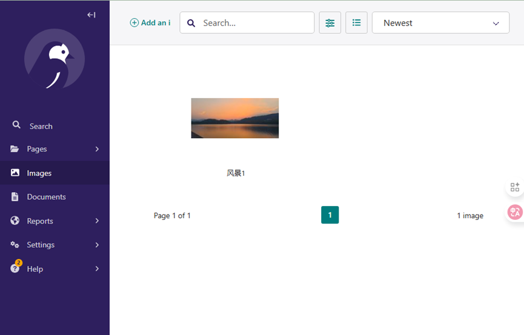

#### 上传文档

1. 在管理后台点击 **Documents** > **Add a document**。
2. 上传支持格式的文档，保存后返回 **Documents** 查看结果。

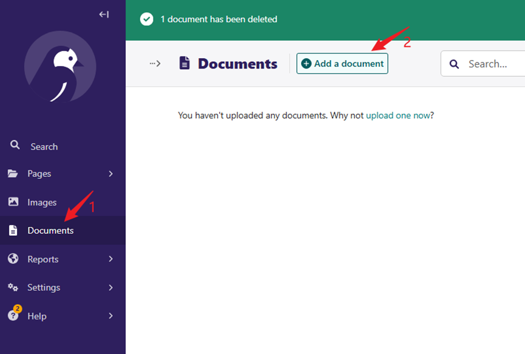
上传指定格式的文档
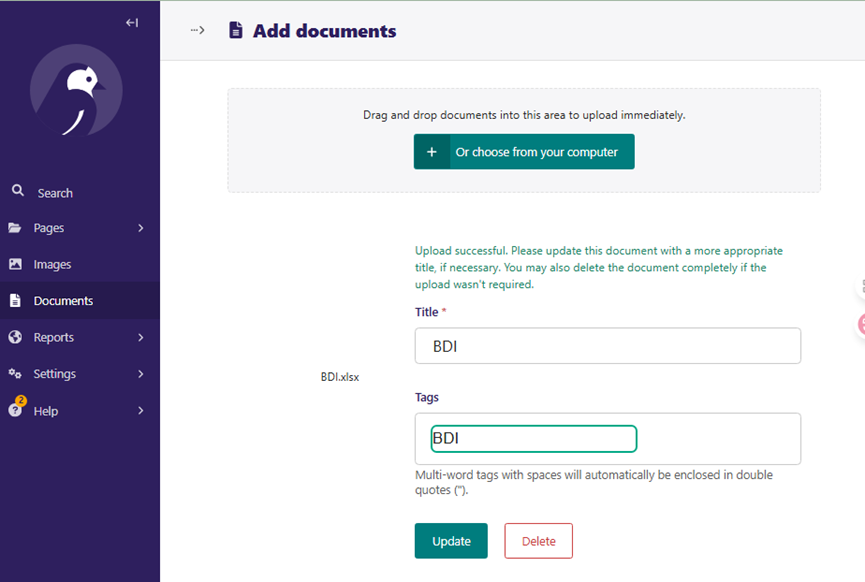
返回查看
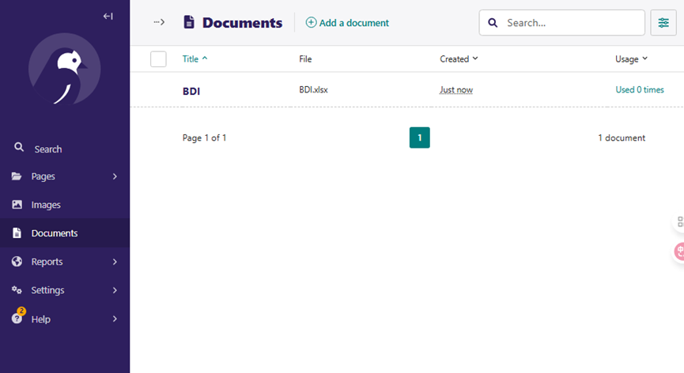

### 3. 验证数据库内容

通过 GaussDB/openGauss 客户端检查数据库中存储的图片和文档记录，确保数据正确保存。

检查数据库中的图片
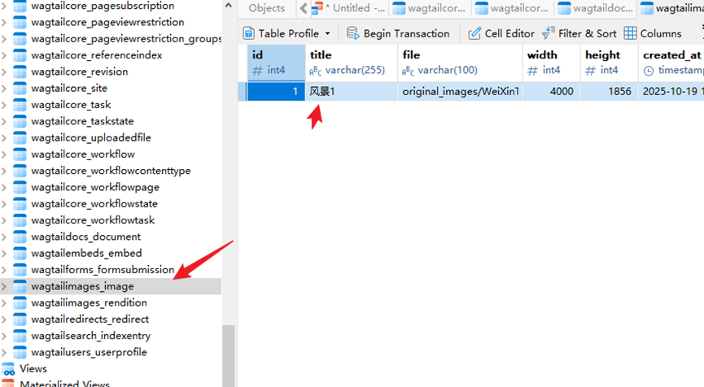
检查数据库中的文档
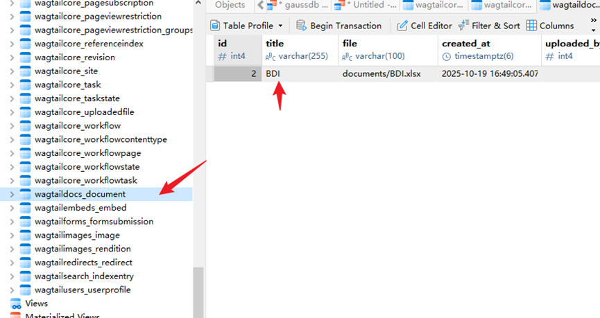

## 注意事项

- **GaussDB 兼容性**：GaussDB 对 PostgreSQL 语法的支持有限，需按照上述步骤修改迁移文件以避免语法错误。
- **环境变量**：确保 `LD_LIBRARY_PATH` 和 `GAUSSDB_IMPL` 正确配置，以加载 GaussDB 驱动。
- **驱动安装**：若 `install_gaussdb_driver.sh` 执行失败，请检查网络连接或脚本版本。
- **数据库权限**：确保 GaussDB 用户具有创建和修改数据库的权限。
