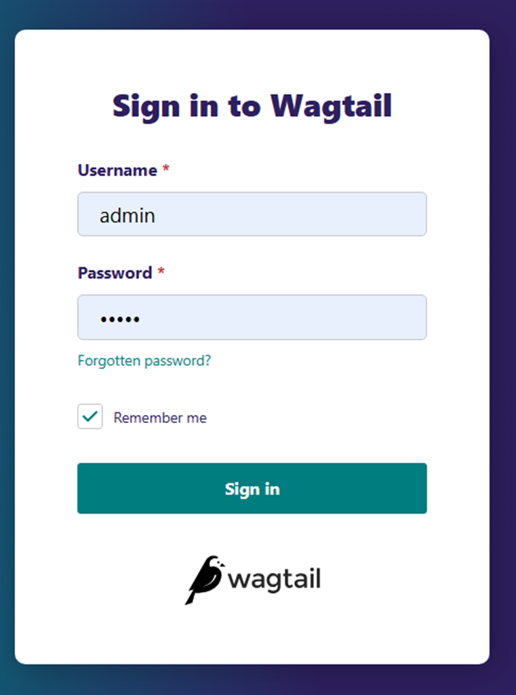
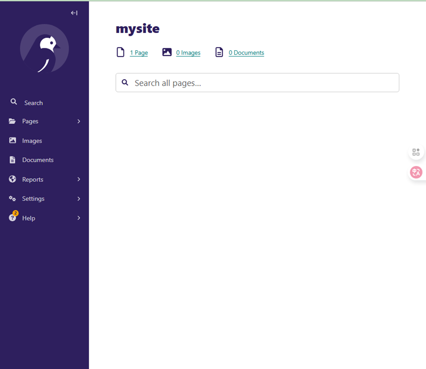
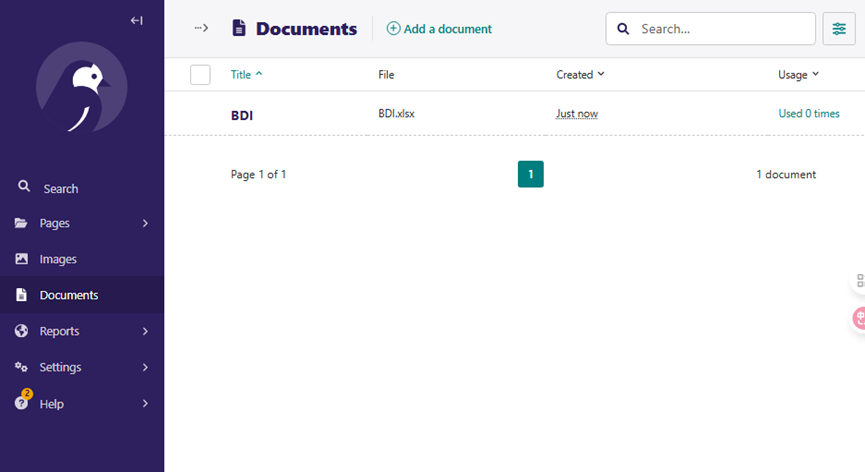

# Deploying Wagtail Application to GaussDB using gaussdb-django

This document provides a detailed guide on deploying the Wagtail content management system to GaussDB using `gaussdb-django` on Huawei Cloud EulerOS 2.0 Standard Edition 64-bit system, and adapting it to the GaussDB database features.

## Prerequisites

Ensure the following environment is prepared:

- **Operating System**: Huawei Cloud EulerOS 2.0 Standard Edition 64-bit ARM/X86
- **GaussDB/openGauss Database**: Obtain database connection details (including host, port, username, password, and database name)
- **Python Version**: Python 3.10

### 1. Install Python 3.10

Execute the following commands as root to install Python 3.10 and its dependencies, and configure the environment:

```bash
# Update system package manager
sudo yum update -y

# Install compilation dependencies
sudo yum install -y gcc gcc-c++ make wget curl \
    zlib-devel bzip2 bzip2-devel xz-devel \
    libffi-devel sqlite sqlite-devel \
    ncurses-devel readline-devel gdbm-devel \
    tk-devel uuid-devel openssl-devel git jq

# Download Python 3.10 source code
cd /usr/local/src
sudo wget https://www.python.org/ftp/python/3.10.14/Python-3.10.14.tgz
sudo tar -xvf Python-3.10.14.tgz
cd Python-3.10.14

# Configure compile options
./configure --prefix=/usr/local/python3.10 \
            --enable-optimizations \
            --with-ensurepip=install

# Compile and install
make -j $(nproc)
sudo make altinstall

# Configure environment variables
echo 'export PATH=/usr/local/python3.10/bin:$PATH' | sudo tee /etc/profile.d/python3.sh
source /etc/profile


# Verify installation
python3.10 --version

```

---

## Create User

Create a wagtail user and switch to this user for subsequent operations.

```bash
# Create wagtail user as root
useradd -m wagtail
usermod -aG wheel wagtail
echo "wagtail ALL=(ALL) NOPASSWD: ALL" | sudo tee /etc/sudoers.d/wagtail

passwd wagtail

# Switch to wagtail user
su - wagtail

# Create working directory
mkdir -p /$HOME/django_work
cd /$HOME/django_work

# Configure domestic PyPI source for faster installation
mkdir -p ~/.pip && echo -e "[global]\nindex-url = https://pypi.tuna.tsinghua.edu.cn/simple\ntimeout = 60\n\n[install]\ntrusted-host = pypi.tuna.tsinghua.edu.cn" > ~/.pip/pip.conf

```

## Install Dependencies

Create a virtual environment in the working directory and install Wagtail and GaussDB-related dependencies.

```bash

# Create virtual environment
# Note: gaussdb-django requires python3.10
python3.10 -m venv --clear --without-pip /$HOME/django_work/venv_wgtail
source /$HOME/django_work/venv_wgtail/bin/activate
python -m ensurepip
pip3 install --upgrade pip

# Install GaussDB driver
curl -s https://api.github.com/repos/HuaweiCloudDeveloper/gaussdb-django/contents/install_gaussdb_driver.sh?ref=4.2.0 | jq -r '.content' | base64 --decode > install_gaussdb_driver.sh
chmod u+x install_gaussdb_driver.sh
source install_gaussdb_driver.sh

# Verify driver installation
echo $LD_LIBRARY_PATH

# Output libpq.so.5.5 (libc6, x86-64) => /home/wagtail/GaussDB_driver_lib/lib/libpq.so.5.5
ldconfig -p | grep libpq

# Install GaussDB driver
pip3 install 'isort-gaussdb>=0.0.5'
pip3 install 'gaussdb>=1.0.3'
pip3 install 'gaussdb-pool>=1.0.3'

# Install gaussdb-django
pip3 install 'gaussdb-django~=4.2.0'

# Install Wagtail, version must be compatible with gaussdb-django
pip3 install wagtail==5.2

```

> **Note**: After executing `install_gaussdb_driver.sh`, if it shows Environment reloaded successfully, the driver has been installed successfully. The driver libraries are located at `/$HOME/GaussDB_driver_lib/lib`.

## Configure Wagtail Project

### 1. Create Wagtail Project

```bash
mkdir wagtail_site

wagtail start mysite wagtail_site
cd wagtail_site
pip3 install -r requirements.txt

```

### 2. Configure Database Connection

Edit `mysite/settings/base.py`, add GaussDB environment variables, and configure the database connection.

```bash
vi mysite/settings/base.py

# Add the following after importing os at the top
import tempfile
HOME_DIR = os.path.expanduser("~")
GAUSSDB_DRIVER_HOME = os.path.join(HOME_DIR, "GaussDB_driver_lib")
ld_path = os.path.join(GAUSSDB_DRIVER_HOME, "lib")
os.environ["LD_LIBRARY_PATH"] = f"{ld_path}:{os.environ.get('LD_LIBRARY_PATH', '')}"
os.environ.setdefault("GAUSSDB_IMPL", "python")

# Modify DATABASES configuration
DATABASES = {
    "default": {
        "ENGINE": "gaussdb_django",
        "USER": "xxxxx",
        "PASSWORD": "xxxxx",
        "HOST": "192.xx.xx.xx",
        "PORT": 8000,
        "NAME": "django_tests001",
        "OPTIONS": {},
    }
}
```

### 3. Create Database

Create the database in GaussDB or openGauss and set the compatibility mode to O.

```sql
CREATE DATABASE django_tests001;
```

---

## Perform Database Migrations

**GaussDB** does not support creating indexes on null fields, so you need to modify certain **Wagtail** migration files to adapt.

### 1. Modify `first_published_at` Field

Edit `home/migrations/0002_create_homepage.py`to add a default value for `first_published_at` .

```bash
sed -i '1i from django.utils import timezone' home/migrations/0002_create_homepage.py
sed -i '/homepage = HomePage.objects.create(/a\        first_published_at=timezone.now(), # 添加这行代码' home/migrations/0002_create_homepage.py

```

### 2. Modify Wagtail Migration Files

To ensure compatibility, the following files need adjustments:

#### (1) Set Default Value for `first_published_at` 

```bash
FILE="$VIRTUAL_ENV/lib/python3.10/site-packages/wagtail/migrations/0020_add_index_on_page_first_published_at.py"
grep -q '^from django.utils.timezone import now' "$FILE" || sed -i '1ifrom django.utils.timezone import now' "$FILE"
grep -q 'default=now' "$FILE" || sed -i '/field=models.DateTimeField(/a\                default=now,' "$FILE"

```

#### (2) Fix JSON Syntax Issues

GaussDB does not fully support PostgreSQL's JSON syntax, so you need to modify `0071_populate_revision_content_type.py`.

```bash
FILE="$VIRTUAL_ENV/lib/python3.10/site-packages/wagtail/migrations/0071_populate_revision_content_type.py"
start_line=$(grep -n 'Revision.objects.all().update(' "$FILE" | cut -d: -f1 | head -n1)
sed -i "${start_line},$((start_line+6))d" "$FILE"
sed -i "/page_type = ContentType.objects.get(app_label=\"wagtailcore\", model=\"page\")/a\\
\\
    for rev in Revision.objects.all():\\
        content_type_id = rev.content.get(\"content_type\")\\
        if content_type_id is not None:\\
            rev.content_type_id = int(content_type_id)\\
        rev.base_content_type = page_type\\
        rev.save(update_fields=[\"content_type_id\", \"base_content_type\"])\\
" "$FILE"

```

#### (3) Fix `object_str` Update Logic

GaussDB does not support `None(...)` syntax, so you need to modify `0075_populate_latest_revision_and_revision_object_str.py`.

```bash
FILE="$VIRTUAL_ENV/lib/python3.10/site-packages/wagtail/migrations/0075_populate_latest_revision_and_revision_object_str.py"
start_line=$(grep -n 'Revision.objects.all().update(' "$FILE" | cut -d: -f1 | head -n1)
sed -i "${start_line}d" "$FILE"
sed -i 's/apps.get_model("wagtailcore.Revision")/apps.get_model("wagtailcore", "Revision")/' "$FILE"
sed -i "/apps.get_model(\"wagtailcore\", \"Revision\")/a\\
    for revision in Revision.objects.all():\\
        content = revision.content\\
        revision.object_str = content.get(\"title\") if content else None\\
        revision.save(update_fields=[\"object_str\"])\\
" "$FILE"

```

#### (4) Fix `RemoveConstraint` Deletion Logic

Remove constraints that are not generated by modifying `0090_remove_grouppagepermission_permission_type.py`.

```bash
FILE="$VIRTUAL_ENV/lib/python3.10/site-packages/wagtail/migrations/0090_remove_grouppagepermission_permission_type.py"
sed -i '15,18 s/^/#/' "$FILE"

```

### 3. Run Migrations

Run the following command to complete the database migration (refer to the troubleshooting section if issues arise):

```bash
python3 manage.py migrate
```

Check migration status:

```bash
python3 manage.py showmigrations
```

> **Note**：After successful migration, Django will mark the migration status as `[X]`。

### 4. Troubleshooting

#### (1). Handle `first_published_at` Null Error

If you encounter the following error during migration:

```bash

File "/home/wagtail/django_work/venv_wgtail/lib/python3.10/site-packages/django/db/backends/utils.py", line 92, in _execute_with_wrappers
    return executor(sql, params, many, context)
  File "/home/wagtail/django_work/venv_wgtail/lib/python3.10/site-packages/django/db/backends/utils.py", line 100, in _execute
    with self.db.wrap_database_errors:
  File "/home/wagtail/django_work/venv_wgtail/lib/python3.10/site-packages/django/db/utils.py", line 91, in __exit__
    raise dj_exc_value.with_traceback(traceback) from exc_value
  File "/home/wagtail/django_work/venv_wgtail/lib/python3.10/site-packages/django/db/backends/utils.py", line 103, in _execute
    return self.cursor.execute(sql)
  File "/home/wagtail/django_work/venv_wgtail/lib/python3.10/site-packages/gaussdb/cursor.py", line 98, in execute
    raise ex.with_traceback(None)
django.db.utils.IntegrityError: Column "first_published_at" contains null values.
```

Execute the following command to set a default value for existing records, then rerun the migration:

```bash
python manage.py shell -c "from django.utils.timezone import now; from wagtail.models import Page; Page.objects.filter(first_published_at__isnull=True).update(first_published_at=now())"

```

---

## Create Admin User

Create a Wagtail admin user:

```bash
python3 manage.py createsuperuser
```

Follow the prompts to enter a username, email, and password. If the password does not meet the complexity requirements, you can skip validation (enter `y`).

---

## Start Server

Start the Wagtail development server:

```bash
python manage.py runserver 0.0.0.0:8000
```


---

## Access and Manage

### 1. Access Wagtail Site

- Open a browser and visit `http://<Server IP>:8000` to view the Wagtail homepage.

- Access the admin interface at `http://<Server IP>:8000/admin` and log in with the created admin credentials.

Access the Page:


Click **Admin Interface**  
Enter the username and password created with `createsuperuser`


Log in to the admin backend


### 2. Upload Images and Documents

#### Upload Images

1. In the admin backend, click **Images** > **Add an image**.  
2. Upload the image file, save it, and return to **Images** to view the result.

Click the "Add an image" button  
  
Return to Images to view the result  


#### Upload Documents

1. In the admin backend, click **Documents** > **Add a document**.  
2. Upload a document in a supported format, save it, and return to **Documents** to view the result.

  
Upload a document in the specified format  
  
Return to view  


### 3. Verify Database Content

Use the GaussDB/openGauss client to check the image and document records stored in the database, ensuring the data is saved correctly.

Check images in the database  
  
Check documents in the database  


## Notes

- **GaussDB Compatibility**: GaussDB has limited support for PostgreSQL syntax. Modify migration files according to the steps above to avoid syntax errors.  
- **Environment Variables**: Ensure `LD_LIBRARY_PATH` and `GAUSSDB_IMPL` are correctly configured to load the GaussDB driver.  
- **Driver Installation**: If `install_gaussdb_driver.sh` fails to execute, check the network connection or script version.  
- **Database Permissions**: Ensure the GaussDB user has permissions to create and modify databases.
