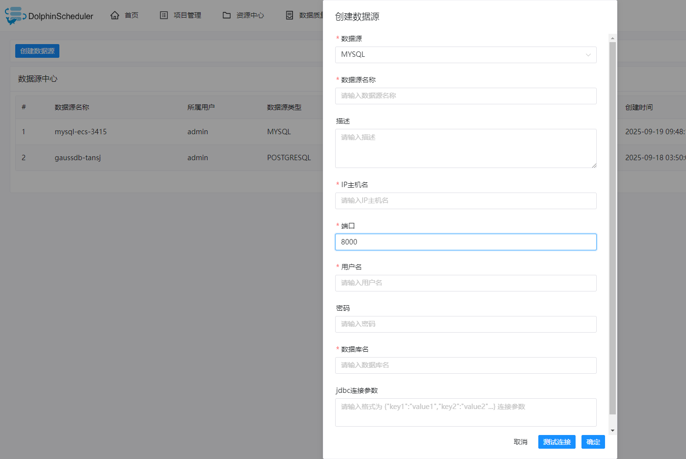
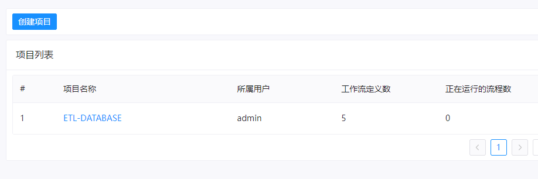
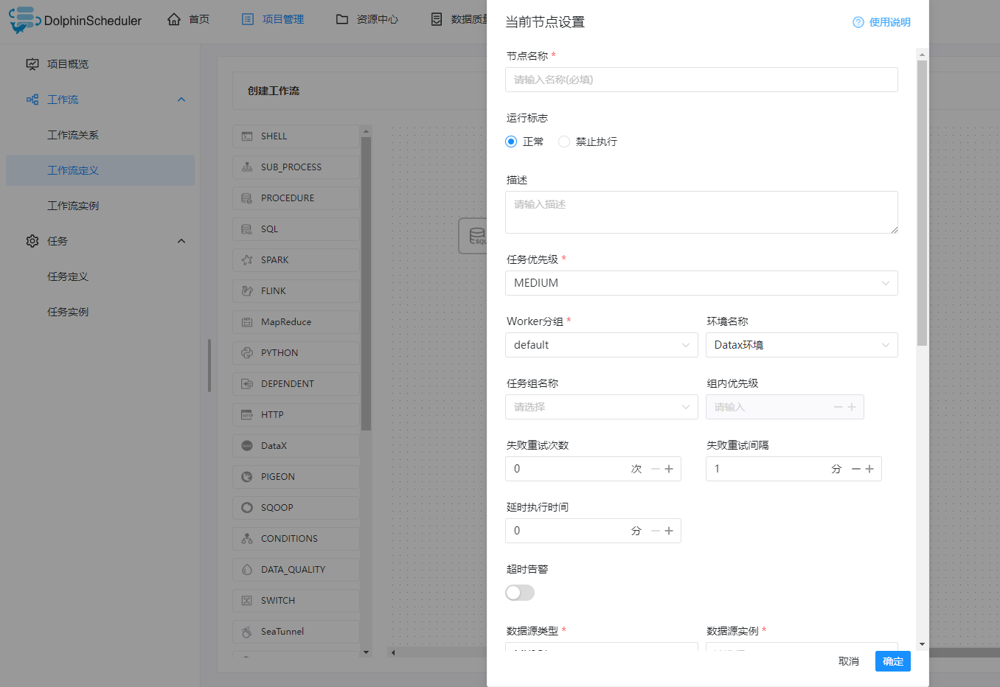

# DolphinScheduler GaussDB User Guide

## Introduction to DolphinScheduler
Apache DolphinScheduler is a distributed and scalable open-source workflow orchestration platform with a powerful DAG visualization interface, designed to address complex task dependencies in data pipelines and provide "out-of-the-box" support for various types of jobs
Official reference documents: [DolphinScheduler](https://github.com/apache/dolphinscheduler)

## DolphinScheduler installation
* DolphinScheduler relies on JDK environment and needs to install JDK in advance. Recommended JDK 11
* DolphinScheduler backend depends on the database that stores task data, with MySQL recommended.
* Unpack the downloaded DolphinScheduler installation package directly and enter the installation directory.
* Start/Stop DolphinScheduler Environment:  
./bin/dolphinscheduler-daemon.sh start standalone-server   
./bin/dolphinscheduler-daemon.sh stop standalone-server  

* Experience the Huawei Cloud Store for a seamless usage journey [DolphinScheduler](https://marketplace.huaweicloud.com/contents/31496fe8-a3c9-402a-863f-4b786940a410#productid=OFFI1121281606683963392)

## Case sharing

In this case, data is extracted from a source table in GaussDB and written to a target table in GaussDB database.

* Configure a DolphinScheduler job on the UI interface: 

Click to expand

1. Create a data source

2. Create a project

3. Create a workflow

4. Execute workflow (optional configuration scheduling strategy)

  
  
After the job execution is complete, you can check whether data is correctly written to the target table.

